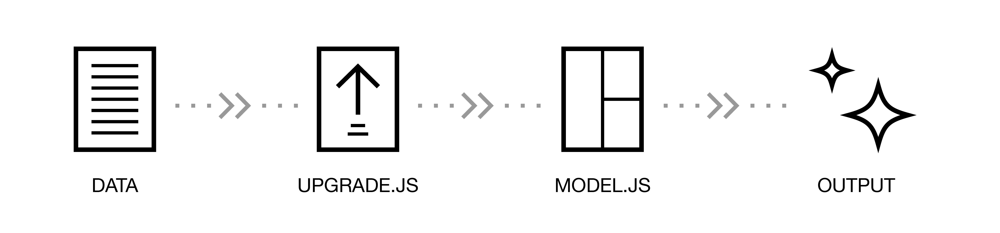

# Data Versioning \(Upgrades\)

Data versioning is a feature of Amphora that aims to address the problem of iterating on component data. As properties are added or removed from a component's data it's easy to reach a point where data that is already in the database does not meet the requirements/expectations of a template or `model.js`. Data versioning allows you to track which "version" of data your component is on and then bring old data up to that current version, increasing the rate at which new features can be developed around a component.

## "Upgrading" Component Data

Components follow a very defined path when they're requested. First the data is retrieved from the database and then it's passed to a `model.js` `render` function for the component \(if one exists\). After that the component data proceeds to the final output destination, whether that's to be templated into HTML or to be consumed as JSON. Upgrades take place immediately after a component's data is retrieved from the database, making the modified data accessible the `model.js`.



## How To Upgrade

Upgrading is easy! You only need two things:

* A `_version` property set to a number in your component's `schema.yaml`
* An `upgrade.js` file in your component's directory

### `\_version` Property

The `_version` property is how upgrades are tracked by Amphora. Whenever a component's data is requested the `_version` property in your component's data is checked against the `_version` property in your component's `schema` file. If the two are not the same value, the component's data will be run through whatever upgrades are specified in your `upgrade.js` file. Things to note about this property:

* You should never modify the `_version` property in your component, Amphora will manage this for you
* The property format `<MAJOR>.<MINOR>` \(i.e. `1.6`\). This allows you to specify "breaking" changes in your component data \(usually removing a property\)

### Upgrade.js file

If the schema specifies _what_ version a component's data should be at, an `upgrade.js` file describes _how_ to get to that version. An `upgrade.js` should export a function for each version number that of schema that you have. For example, if you're writing your first upgrade for a component and want to write an upgrade to `1.0`, your `upgrade.js` would have the following:

```javascript
module.exports['1.0'] = function () {
  //...upgrade goes here
};
```

For every version that you increment, just add a corresponding function and they'll be run! But what about the structure of the function? The function signature for an `upgrade.js` file is the exact same as a `model.js` file. The functions will receive the same arguments and should return a Javascript Object or a `Promise` that resolves an Object.

```javascript
module.exports['1.0'] = function (uri, data, locals) {
  // Modify your `data` here and return a Promise or JS Object
};
```

## FAQ

### So all the upgrades for a component run every time a component is requested? 

An upgrade is only run **once** per component instance. The `_version` property is used to track the version of the data and then upgrades are reduced through, make sure that a upgrades are run in ascending order.

For example, if your component data is on version `1.0` and your schema version is at `1.6`, Amphora will run your data through each upgrade \(from `1.1` to `1.6`\) and return the data expected for `1.6`. In this way, even the oldest data in your system is up-to-date with `model.js` and template expectations.

### Why not just use an external script or render function?

Transforming data in a `model.js` `render` function will lead to bloat of the file which will require more development time as devs must keep all of the possible permutations of the data in mind when making changes.

Using an external script will require careful coordination when releasing new features and updating data.

Data versioning allows you iterate and release without fear that your data needs to undergo its own migration.

